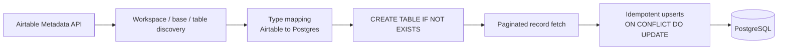

# GhostMap

<p align="center">
  <a href="https://github.com/Gond-ul/GhostMap/actions/workflows/ci.yml">
    
  </a>
  
  
  
</p>

Discovers your Airtable workspaces, extracts base and table schemas via the Airtable metadata API, and mirrors them into a local database — built for migrating Airtable data to on-prem setups.

## Architecture

`airtable_to_postgres.py` walks the Airtable Metadata API top-down (workspace → base → table), derives a matching Postgres schema from each table's field types, and syncs records with idempotent upserts.



## Scripts

This repo contains two entry points:

| Script | What it does | Databases |
|---|---|---|
| `airtable_to_postgres.py` | Full mirror: discovers every workspace → base → table your token can access, creates a matching Postgres table per Airtable table (named `{workspace}_{base}_{table}`, with Airtable field types mapped to Postgres types), and upserts all records | PostgreSQL |
| `sync.py` | Minimal single-table sync with a fixed 3-column schema (`id`, `name`, `email`) | PostgreSQL or SQL Server |

## Prerequisites

- Python 3.x
- PostgreSQL — or SQL Server with ODBC Driver 17, for `sync.py`
- An Airtable Personal Access Token with schema-read and data-read scopes

## Quick start (local Postgres via Docker)

Spin up a local PostgreSQL instance and run the full mirror against it:

```bash
docker compose up -d
cp env.example .env
```

Edit `.env` and set:
- `AIRTABLE_TOKEN` — your Airtable Personal Access Token
- `POSTGRES_HOST=localhost`, `POSTGRES_PORT=5432`, `POSTGRES_DB=ghostmap`, `POSTGRES_USER=ghostmap`, `POSTGRES_PASSWORD=ghostmap` (matches `docker-compose.yml`)

Then run:

```bash
python airtable_to_postgres.py
```

## Setup

1. Install dependencies:
```bash
pip install -r requirements.txt
```

2. Configure your environment — copy `env.example` to `.env` and fill in your values.

   **For `airtable_to_postgres.py`:**
   - `AIRTABLE_TOKEN` — Airtable Personal Access Token
   - `POSTGRES_DB`, `POSTGRES_USER`, `POSTGRES_PASSWORD`, `POSTGRES_HOST`, `POSTGRES_PORT`

   **For `sync.py`:**
   - `AIRTABLE_API_KEY`, `AIRTABLE_BASE_ID`, `AIRTABLE_TABLE_NAME`
   - `DB_TYPE` — `postgres` or `sqlserver`
   - PostgreSQL: `PG_DBNAME`, `PG_USER`, `PG_PASSWORD`, `PG_HOST`, `PG_PORT`
   - SQL Server: `SQLSERVER_HOST`, `SQLSERVER_DB` (uses Windows Authentication — no password required)

3. Run:
```bash
python airtable_to_postgres.py   # full workspace mirror (PostgreSQL)
# or
python sync.py                   # single-table sync (PostgreSQL / SQL Server)
```

## Testing

The test suite covers the pure transformation logic (name sanitization, Airtable → Postgres type mapping, value conversion) and the Airtable Metadata API client, with HTTP calls mocked so tests run without real credentials or a live database.

```bash
pip install -r requirements-dev.txt
pytest
```

CI runs this suite on every push to `main` and on every pull request (see the badge above).

## Features

- One-way sync from Airtable into a local database
- Workspace → base → table discovery via Airtable's metadata API (`airtable_to_postgres.py`)
- Automatic Postgres table creation mapped from Airtable field types (complex fields stored as JSONB)
- Idempotent upserts (`ON CONFLICT (id) DO UPDATE`)
- Airtable API rate-limit handling and pagination
- Logging to `airtable_sync.log` (`airtable_to_postgres.py`)
- `.env` file permissions hardened to `0600` automatically

## License

MIT — see [LICENSE](LICENSE).
